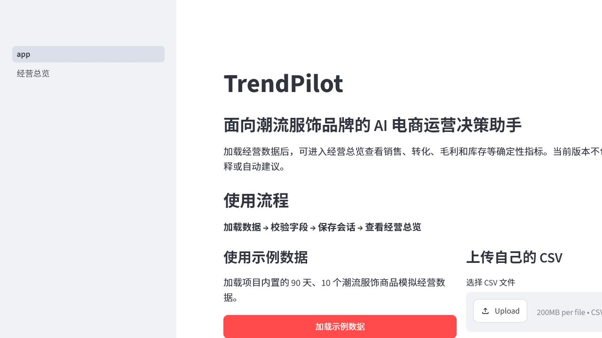
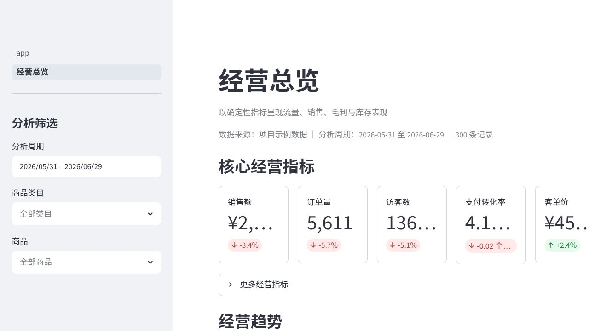
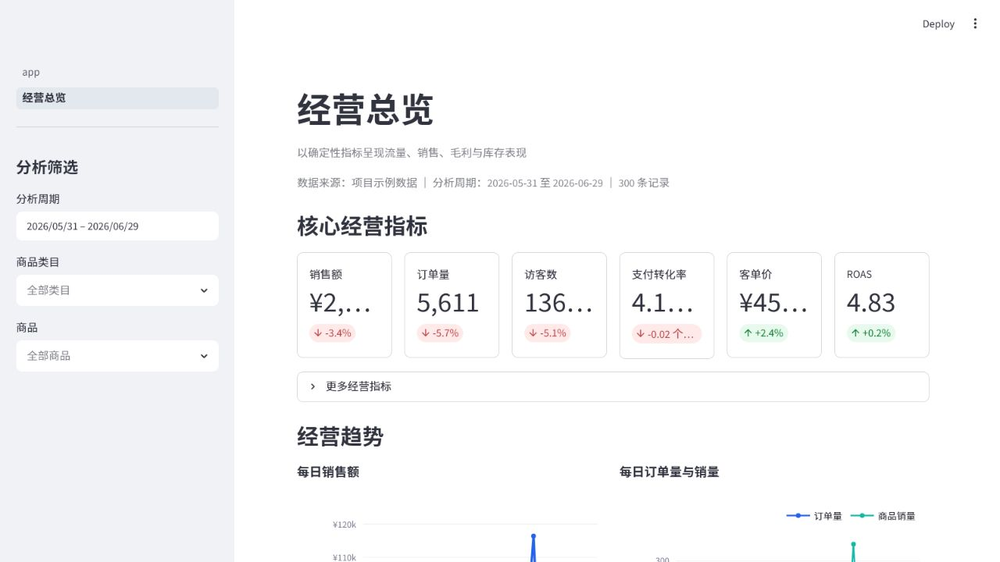
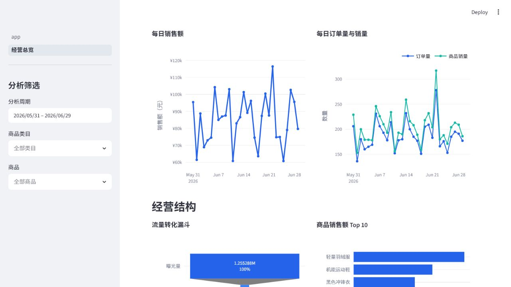
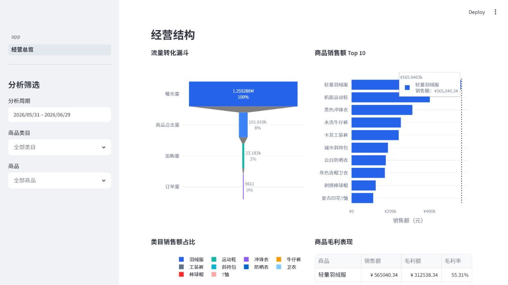
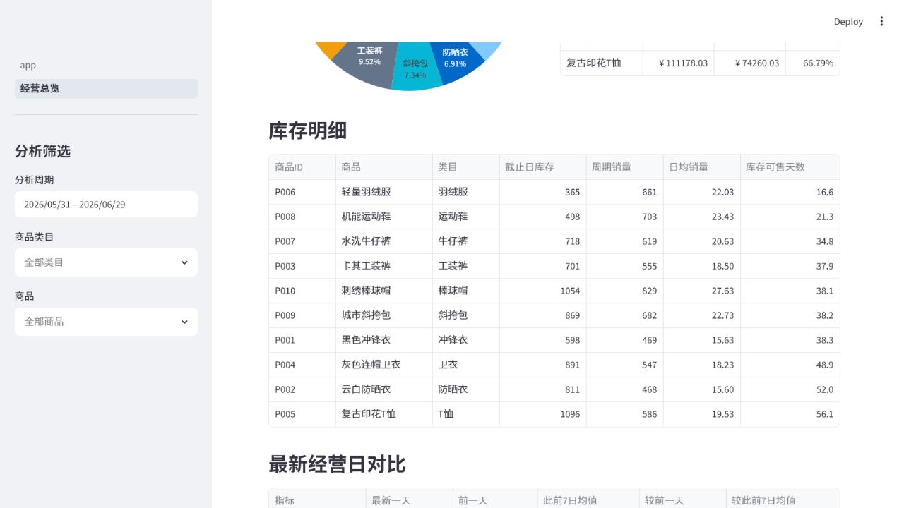

# TrendPilot

> 面向潮流服饰品牌的 AI 电商运营决策助手

TrendPilot 是一个用于 AI 产品经理面试展示的本地 MVP。当前 Phase 2 已实现经营数据上传、校验、确定性指标计算和可交互经营 Dashboard，帮助运营人员快速查看销售、转化、毛利与库存表现。

本版本不包含异常检测、原因解释、LLM 或 AI 建议，所有展示数字均由 Pandas 按明确公式计算。

## 已实现功能

- 加载内置示例 CSV，或上传用户自己的 CSV。
- 校验必填字段、日期、标识字段、非负数值和 0–5 分评分。
- 默认分析最近 30 天，支持日期、类目和商品联动筛选。
- 展示核心 KPI、经营趋势、流量转化漏斗、商品与类目结构、毛利及库存明细。
- 对比上一等长周期，以及最新一天、前一天和此前 7 日均值。
- 内置固定随机种子生成的 90 天、10 商品、900 行 UTF-8 BOM 示例数据。

## 产品截图

### 首页数据上传



### 经营总览 Dashboard



### 核心 KPI 指标



### 销售与订单趋势



### 商品销售额排名



### 库存分析



## 指标口径

所有比率均先汇总分子与分母，再执行除法。

| 指标 | 公式 |
|---|---|
| 点击率 | `Σproduct_clicks / Σimpressions` |
| 加购率 | `Σadd_to_cart / Σproduct_clicks` |
| 支付转化率 | `Σorders / Σvisitors` |
| 退款率 | `Σrefund_units / Σunits_sold` |
| 客单价 | `Σsales_amount / Σorders` |
| ROAS | `Σsales_amount / Σad_spend` |
| 毛利额 | `Σsales_amount - Σ(cost × units_sold)` |
| 毛利率 | `毛利额 / Σsales_amount` |
| 日均销量 | `Σunits_sold / 周期自然日数` |
| 当前库存 | 每个商品在截止日前最后一条库存之和 |
| 库存可售天数 | `当前库存 / 周期日均销量` |

普通比率分母为零时返回 `0.0`；日均销量为零时库存可售天数为空。比率类周期变化使用百分点，其余指标使用相对变化率。

## 快速开始

需要 Python 3.11+。

```powershell
python -m venv .venv
.\.venv\Scripts\Activate.ps1
python -m pip install -r requirements.txt
python -m streamlit run app.py
```

打开首页后点击“加载示例数据”，再进入“经营总览”。

## 运行测试

```powershell
python -m pytest
```

## 重新生成示例数据

```powershell
python scripts/generate_sample_data.py
```

脚本使用固定随机种子，并将 CSV 写为 UTF-8 with BOM。

## 项目结构

```text
app.py                         # 数据加载与校验首页
pages/1_经营总览.py            # 经营 Dashboard
src/data_loader.py             # CSV 读取与摘要
src/data_validator.py          # 必填字段校验
src/data_processor.py          # 分析数据准备与筛选
src/metrics.py                 # 确定性经营指标
src/charts.py                  # Plotly 图表构建
data/sample_sales_data.csv     # 示例经营数据
scripts/generate_sample_data.py
tests/                         # pytest 与 Streamlit AppTest
docs/screenshots/              # 后续 README 截图目录
```

## 数据字段

CSV 必须包含：

```text
date, product_id, product_name, category, price, cost,
impressions, visitors, product_clicks, add_to_cart, orders,
units_sold, sales_amount, ad_spend, refund_units, inventory, rating
```

## 当前边界

- Session State 数据不会跨浏览器会话持久化。
- 当前库存取截止日前每个商品的最新记录，依赖源数据库存字段准确。
- Dashboard 只做描述性计算，不判断指标好坏，也不生成运营结论。
- `docs/screenshots/` 仅为后续展示素材预留，本阶段不包含正式截图。
