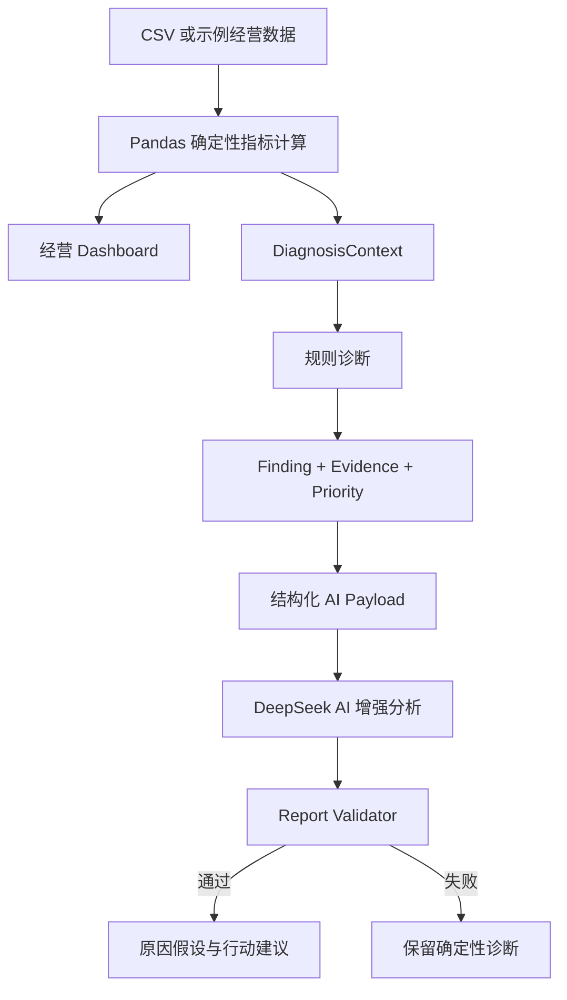
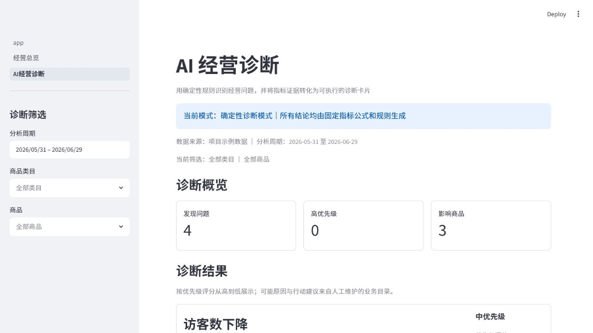
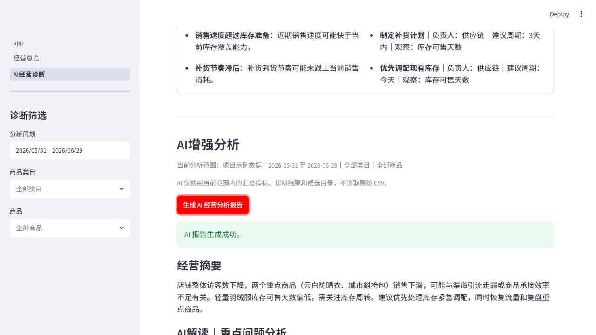

# TrendPilot

> 面向潮流服饰品牌电商运营人员的 AI 经营决策助手：从经营数据中发现问题，并将确定性诊断转化为可验证的原因假设和行动顺序。

TrendPilot 是一个用于 AI 产品经理面试展示的本地 MVP。它不是让大语言模型直接“读表下结论”，而是通过确定性指标、规则诊断、受约束的 AI 解读和输出校验，建立一条可信的经营分析链路。

```text
上传经营数据
→ 查看经营 Dashboard
→ 发现高优先级问题
→ 生成 AI 经营分析报告
→ 验证原因假设并安排后续行动
```

当前状态：Phase 1–3 已完成，AI Report MVP 已在单个黄金场景中完成 DeepSeek 真实模型链路的受控验证，达到当前面试演示标准。

## 产品背景与用户问题

潮流服饰电商具有上新快、商品生命周期短、流量波动大和库存变化快的特点。运营人员需要同时关注销售、访客、转化、广告、毛利、退款和库存，但这些信息往往分散在不同报表中。

传统 Dashboard 能告诉用户“指标是多少”，却不一定能进一步回答：

- 当前最值得关注的问题是什么？
- 销售、流量、转化和广告效率之间可能有什么关系？
- 多个问题同时出现时，应该先处理哪一个？
- 哪些原因只是猜测，应该如何验证？
- 下一步应该采取什么具体行动，并观察哪些指标？

纯 LLM 分析同样存在风险：如果模型直接读取原始 CSV 并自行计算，它可能使用错误口径、遗漏数据或生成无法追溯的数字。运营人员看到的是一份流畅报告，却难以判断结论是否可信。

## 产品目标

TrendPilot 希望把经营分析从“展示数据”推进到“辅助决策”，帮助运营人员完成三件事：

1. **快速发现问题**：用统一指标口径和规则阈值识别值得关注的经营变化。
2. **理解问题关系**：让 AI 在已有证据之上综合多个问题，提出待验证的原因假设。
3. **明确下一步行动**：从受控行动目录中选择建议，组织执行顺序并说明验证指标。

产品成功不以“AI 写得像专家”作为唯一标准，而以事实是否可信、问题是否清楚、行动是否可验证、AI 失败后核心流程是否仍然可用作为 MVP 验收标准。

当前项目尚未通过真实业务用户验证销售提升或运营提效，因此不宣称已经带来业务增长。现阶段验证的是产品闭环、AI 增量价值和输出可靠性。

## 核心能力

### 1. 经营数据分析 Dashboard

- 支持内置示例数据和用户 CSV 上传，并校验 17 个必填字段。
- 支持日期、类目和商品联动筛选，默认分析最近 30 天。
- 展示 KPI、上一等长周期对比、每日趋势和流量转化漏斗。
- 覆盖销售、访客、转化、广告、退款、毛利、商品排名、类目结构和库存分析。
- 内置 90 天、10 个商品、900 行可复现的中文示例经营数据。

### 2. 规则驱动诊断系统

- 复用 Dashboard 的确定性指标，不让页面或 AI 重新计算业务数字。
- 识别销售、访客、支付转化率、ROAS、广告投入、毛利率、退款率、库存和重点商品问题。
- 每个问题包含数据证据、影响范围、系统判断和高/中/低优先级。
- Cause Catalog 提供受控原因候选，Action Catalog 提供带负责人、建议周期和观察指标的行动候选。
- 诊断卡片明确区分“数据证据”“系统判断”“可能原因”和“行动建议”。

### 3. AI 经营分析报告

- AI 只接收当前筛选范围内的 KPI 摘要、Finding、Evidence 和对应的 Cause/Action 候选。
- 综合多个诊断问题，生成经营摘要、问题关联、原因假设、验证方法和行动顺序。
- AI 可以解释和组织，但不能创建新问题、修改 Finding Priority 或重新计算指标。
- 报告通过结构和业务引用校验后才会展示。
- 无 API Key、Provider 调用失败或 Validator 拒绝时，Dashboard 和确定性诊断仍然可用。
- 当前真实演示 Provider 为 DeepSeek。真实评估通过 `AI_MODEL` 显式配置使用 `deepseek-v4-flash`；当前 DeepSeek Provider 未配置 `AI_MODEL` 时仍默认使用 `deepseek-v4-pro`。Fake Provider 保留用于稳定测试和无网络演示。

## 产品架构



这套架构刻意把“事实、判断和解释”分开：

- **规则系统负责事实判断**：Pandas 计算指标，Rule Engine 根据统一阈值发现问题并确定 Finding Priority。
- **AI 负责解释和组织**：综合已有 Finding，分析可能关联，选择原因假设并安排 Action Sequence。
- **Validator 负责发布门槛**：检查输出结构和业务 ID 引用，未通过的报告不会展示。
- **运营人员负责最终决策**：结合业务背景验证假设，而不是无条件接受 AI 结论。

## 为什么不直接让 LLM 分析 CSV

“上传 CSV 后直接让模型生成报告”实现更快，但不符合经营决策场景对一致性和可追溯性的要求。

### 1. 指标口径需要确定性

例如支付转化率固定采用“订单总量 ÷ 访客总量”，而不是平均每日转化率。指标必须由同一套逻辑稳定计算，不能依赖模型每次临时理解。

### 2. 原始数据会放大模型风险

大量行级数据增加上下文成本，也会提高遗漏、误算和生成输入外数字的概率。即使语言流畅，用户也难以追溯结论来自哪项证据。

### 3. AI 应该补足系统能力，而不是重复计算

规则系统擅长发现边界明确的问题，AI 更适合处理跨问题综合、假设表达和行动组织。让二者各自承担擅长的任务，比把全部责任交给模型更可靠。

因此，TrendPilot 不向 LLM 发送原始 CSV 或完整 DataFrame，只发送经过白名单筛选、可 JSON 序列化的结构化 Payload。页面再根据 `finding_id` 渲染确定性证据，使每条 AI 解读都有可追溯来源。

## AI 治理设计

TrendPilot 从输入、任务、输出、模型接入和失败状态五个环节约束 AI：

- **Payload 约束**：模型不接收原始 CSV，只接收当前分析范围内的白名单信息。
- **Prompt 约束**：明确 AI 能做什么、不能做什么，以及原因和行动的表达方式。
- **Validator 门禁**：非法结构或无效业务引用不会进入页面。
- **Provider 抽象**：模型调用与产品逻辑分离，便于替换与测试。
- **降级机制**：AI 失败不影响 Dashboard 和确定性诊断。

<details>
<summary>展开查看 AI 治理机制细节</summary>

### Payload 约束

模型只能接收当前分析范围、白名单 KPI、Finding、Evidence，以及每个 Finding 允许使用的 Cause 和 Action 候选。原始 CSV、Session State 和无关字段不会进入模型上下文。

### Prompt 约束

Prompt 明确 AI 的允许与禁止事项：

- 可以综合已有问题、提出原因假设、给出验证方法和组织行动顺序；
- 不能创建新的 Finding、Cause ID 或 Action ID；
- 不能修改 Finding Priority、重新计算指标或编造业务事实数字；
- 原因必须使用“可能、假设、待验证”等表达，不能把相关性写成确定因果；
- 行动必须说明执行动作、验证指标和判断条件；
- Action Sequence 必须在整份报告中从 1 开始、连续且唯一。

### Validator

第一版 Validator 校验：

- JSON 结构、必填字段和字段类型；
- Finding 引用是否来自当前诊断结果；
- Cause/Action 是否属于对应 Finding 的允许候选；
- 跨问题洞察是否只引用有效 Finding；
- Action Sequence 是否全局连续且唯一。

Validator 不负责自然语言事实审核、复杂因果判断或内容安全审核。这是当前 MVP 的明确边界，而不是已经完成的能力。

### Provider 抽象

页面不直接调用模型 SDK，也不处理 Prompt 或 API Key。统一的 Provider 接口隔离模型差异，AI Report Service 负责串联 Payload、Provider 和 Validator。当前真实演示使用 DeepSeek，同时保留 OpenAI Provider 和 Fake Provider，以支持模型替换、Mock 测试和无网络演示。

### 降级机制

AI 是增强能力，不是核心经营分析的单点依赖。无 Key、调用超时、空响应或校验失败时，页面不会展示未经验证的报告，用户仍可继续查看 Dashboard 和确定性诊断结果。

</details>

## Demo 展示

已展示图片均来自真实产品运行结果，完整呈现从数据上传、规则诊断到 AI 增强分析的产品流程。

### 1. 数据上传与经营总览

#### 首页数据上传


#### 经营总览 Dashboard


#### 核心 KPI 指标


#### 销售与订单趋势


#### 商品销售额排名


#### 库存分析


### 2. 规则诊断发现问题

规则引擎基于经营指标识别经营问题，并提供可追溯的 Evidence、系统判断、优先级以及受控的原因和行动候选。



### 3. AI 增强分析报告

AI 基于规则诊断结果进行多问题关联、原因假设和行动建议组织。AI 不替代业务判断，仅提供决策辅助。



## AI 效果评估

TrendPilot 不只检查“模型是否返回内容”，而是同时验证结构可靠性和 AI 增量价值。

### 评估方法

- 建立 5 个黄金业务场景，覆盖流量下降、转化下降、广告低效、毛利下降和重点商品库存风险。
- 自动检查 JSON、Finding/Cause/Action 引用、Action Sequence 和失败降级。
- 人工评分关注问题理解、多问题关联、假设表达、验证可执行性、行动排序和相对规则卡片的额外价值。
- 真实 API 不进入自动化测试，避免测试依赖网络或真实密钥。

### 第一次失败与迭代

第一次真实生成虽然返回合法 JSON，但模型把 Action Sequence 理解为每个 Finding 内部排序，产生重复编号。Validator 拒绝了报告，证明“格式合法”不等于“产品可以展示”。

随后没有放宽 Validator，而是收紧 Prompt：明确行动序号是报告级全局顺序，强化假设语气，并要求每条行动包含执行动作、验证指标和判断条件。

### DeepSeek 单场景受控真实验证结果

以下数据来自同一个黄金场景的第二次真实模型复测，用于验证端到端链路和 Prompt 迭代效果，不代表全部场景的平均性能。

| 验证项 | 结果 |
|---|---|
| Provider | DeepSeek |
| Model | `deepseek-v4-flash` |
| 响应时间 | 约 20.9 秒 |
| JSON | 合法 |
| Validator | 通过 |
| Service 状态 | `success` |
| 人工评分 | 4.5/5 |
| 自动化测试 | 156 passed |

该结果说明 AI Report MVP 在当前受控场景下已达到面试展示标准，但不代表整体平均性能或生产质量。当前真实模型评估样本仍然有限，后续还需要对 5 个黄金场景进行多轮重复验证。

## MVP 取舍与当前边界

- **先规则、后 AI**：先稳定指标和问题判断，再让 AI 提供解释与行动组织，避免做成 LLM 直接读表的套壳产品。
- **受控候选优先**：Cause/Action Catalog 限制了自由生成范围，但提高了可验证性和输出一致性。
- **拒绝非法报告**：Validator 失败时不展示报告，宁可降级，也不向用户输出引用错误的内容。
- **不做多模型 UI**：Provider 保持可替换，但当前用户流程不增加模型选择负担。
- **主动控制范围**：当前没有自由聊天、Agent、多 Agent、RAG、数据库、历史报告、长期记忆、自动执行、销售预测或权限系统。
- **本地 MVP 定位**：Session State 只保存当前浏览器会话数据；项目用于验证产品闭环和面试展示，不是生产级企业软件。

## 技术架构

技术实现服务于产品边界，而不是让页面承担业务计算。首页保留产品所依赖的关键技术分层，详细指标口径折叠展示。

<details>
<summary>展开查看技术分层与指标口径</summary>

| 层级 | 主要职责 | 当前技术 |
|---|---|---|
| 数据入口 | CSV 加载、字段校验、会话数据保存 | Streamlit、Pandas |
| 指标分析 | KPI、周期对比、商品、类目和库存汇总 | Pandas |
| 诊断系统 | Context、规则判断、证据和优先级 | Python 确定性规则 |
| AI 增强 | Payload、Prompt、Provider、报告编排 | DeepSeek、OpenAI Python SDK |
| 输出治理 | JSON Schema、业务 ID 引用与行动序号校验 | Report Validator |
| 展示 | Dashboard、诊断卡片和 AI 报告 | Streamlit、Plotly |
| 质量保障 | 单元、集成和页面测试 | pytest、Streamlit AppTest |

关键指标继续采用统一确定性口径，所有比率均先汇总分子与分母再执行除法：

| 指标 | 公式 |
|---|---|
| 点击率 | `Σproduct_clicks / Σimpressions` |
| 加购率 | `Σadd_to_cart / Σproduct_clicks` |
| 支付转化率 | `Σorders / Σvisitors` |
| 退款率 | `Σrefund_units / Σunits_sold` |
| 客单价 | `Σsales_amount / Σorders` |
| ROAS | `Σsales_amount / Σad_spend` |
| 毛利额 | `Σsales_amount - Σ(cost × units_sold)` |
| 毛利率 | `毛利额 / Σsales_amount` |
| 当前库存 | 每个商品在截止日前最后一条库存之和 |
| 库存可售天数 | `当前库存 / 周期日均销量` |

普通比率分母为零时返回 `0.0`；日均销量为零时库存可售天数为空。比率类周期变化使用百分点，其余指标使用相对变化率。

</details>

## 本地运行

需要 Python 3.11+。

### 1. 创建并启用虚拟环境

```powershell
python -m venv .venv
.\.venv\Scripts\Activate.ps1
```

### 2. 安装依赖并启动应用

```powershell
python -m pip install -r requirements.txt
python -m streamlit run app.py
```

打开首页后点击“加载示例数据”，依次进入“经营总览”和“AI 经营诊断”。未配置 AI 服务时，确定性分析和诊断仍然可用。

### 3. 配置真实 DeepSeek 服务（可选）

<details>
<summary>展开查看本地 AI 服务配置</summary>

API Key 只能通过本地环境变量或未提交的 Streamlit secrets 配置，不应写入代码或提交到仓库。

```text
AI_PROVIDER=deepseek
AI_API_KEY=本地密钥
AI_BASE_URL=DeepSeek API 地址
AI_MODEL=deepseek-v4-flash
```

真实评估通过 `AI_MODEL` 显式选择 `deepseek-v4-flash`。如果不配置 `AI_MODEL`，当前 DeepSeek Provider 默认使用 `deepseek-v4-pro`。

</details>

### 4. 运行测试

```powershell
python -m pytest
```

当前测试基线：`156 passed`。

### 5. 重新生成示例数据

```powershell
python scripts/generate_sample_data.py
```

脚本使用固定随机种子，将 CSV 写为 UTF-8 with BOM。

<details>
<summary>CSV 必填字段</summary>

```text
date, product_id, product_name, category, price, cost,
impressions, visitors, product_clicks, add_to_cart, orders,
units_sold, sales_amount, ad_spend, refund_units, inventory, rating
```

</details>

## 项目材料

- [AI PM Case Study](docs/TRENDPILOT_AI_PM_CASE_STUDY.md)：完整的产品决策、AI 治理、失败迭代和评估复盘。
- [AI Report PRD](docs/PHASE3_AI_REPORT_PRD.md)：AI 经营分析报告的冻结产品要求。
- [AI Report Schema](docs/AI_REPORT_SCHEMA.md)：Prompt、Provider、Validator 和页面共同遵循的输出约束。
- [AI Evaluation](docs/AI_EVALUATION.md)：黄金场景与评估方法。
- [AI Evaluation Result](docs/AI_EVALUATION_RESULT.md)：真实 DeepSeek 评估记录。
- [Project Context](docs/PROJECT_CONTEXT.md)：当前项目状态、边界和后续工作。

---

> TrendPilot 的核心设计理念：确定性系统负责事实和约束，AI 负责理解和组织，运营人员保留最终决策权。
