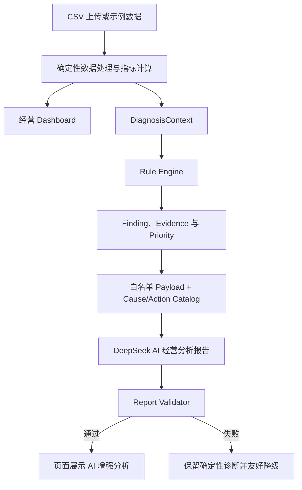

# TrendPilot AI PM Case Study

## 案例摘要

TrendPilot 是一个面向潮流服饰品牌电商运营人员的 AI 经营决策助手，也是一个用于 AI 产品经理面试展示的本地 MVP。

项目没有让大语言模型直接读取原始经营数据，而是先通过确定性系统完成指标计算和问题识别，再由 AI 综合解释问题、提出待验证的原因假设并组织行动顺序，最后通过 Validator 校验输出。它希望解决的不是“生成一篇看起来专业的报告”，而是帮助运营人员更快理解经营问题、明确下一步应该检查什么和采取什么行动。

当前版本已完成从数据上传、经营 Dashboard、确定性诊断到 AI 经营分析报告的完整演示闭环。真实模型采用 DeepSeek，当前验证模型为 `deepseek-v4-flash`；第二次真实评估中，报告通过 Validator，人工质量评分为 4.5/5。项目当前共有 156 个自动化测试，但仍定位为面试展示 MVP，而非生产级企业软件。

---

## 1. 产品背景

潮流服饰电商具有上新快、商品生命周期短、流量和库存变化快的特点。运营人员每天需要同时关注销售、流量、转化、广告、毛利、退款和库存等信息，但这些信息往往分散在不同报表中。

传统 Dashboard 能回答“指标是多少”，却不一定能回答：

- 当前最值得关注的问题是什么；
- 多个指标变化之间可能有什么关系；
- 哪个问题应该优先处理；
- 下一步应该验证什么、采取什么行动。

因此，TrendPilot 的产品机会不是再做一个展示数据的看板，而是在可信数据分析的基础上，增加“发现问题—理解问题—规划行动”的决策辅助能力。

## 2. 用户痛点

目标用户是中小型潮流服饰品牌的电商运营人员，以及需要协同处理商品、广告和库存问题的团队成员。

核心痛点包括：

1. **数据处理成本高**：原始数据需要人工清洗、汇总和计算，指标口径容易不一致。
2. **看见数据但找不到重点**：同时出现多个指标波动时，运营人员需要自己判断哪些问题更重要。
3. **缺少跨问题理解**：销售下降可能与流量、转化、广告效率或重点商品有关，单张规则卡片难以形成整体判断。
4. **行动建议不够具体**：泛化的“优化广告”“调整库存”不能直接支持执行，也缺少验证指标。
5. **不信任纯 AI 分析**：如果模型直接读取 CSV，用户难以确认数字如何得出，也无法判断 AI 是否遗漏、误算或编造事实。

## 3. 产品目标

TrendPilot 的 MVP 目标是建立一条可演示、可解释、可降级的经营分析闭环：

> 上传经营数据 → 查看确定性指标 → 发现经营问题 → 获得 AI 综合解读 → 明确验证方式和行动顺序

产品成功不以“AI 写得像专家”作为唯一标准，而关注四个结果：

- **事实可信**：所有业务指标由确定性系统计算；
- **问题清楚**：规则引擎识别问题并提供证据和优先级；
- **行动可用**：AI 从受控候选中选择并组织行动，说明验证方式；
- **失败可控**：AI 不可用或输出不合法时，确定性诊断仍然可用。

当前项目尚未通过真实业务用户验证销售提升或运营提效，因此不宣称已经产生业务增长结果。现阶段验证的是产品闭环、AI 增量价值和输出可靠性。

## 4. 为什么选择 AI

确定性规则适合识别边界明确的问题，例如销售额下降超过阈值、ROAS 下降或库存可售天数过低。但当多个问题同时出现时，单纯增加规则会带来两个问题：一是规则组合迅速变复杂，二是输出仍然像一组分散的告警。

AI 的价值在于处理规则系统不擅长的“理解和组织”任务：

- 综合多个 Finding，形成经营摘要；
- 解释问题之间可能存在的关系，但不把相关性写成确定因果；
- 从 Cause Catalog 中选择值得优先验证的原因假设；
- 从 Action Catalog 中选择行动并安排全局执行顺序；
- 用运营人员容易理解的语言说明数据限制。

因此，AI 不是替代规则引擎，而是在已有事实和诊断之上降低用户的理解成本与决策组织成本。

## 5. 为什么不用 LLM 直接分析 CSV

让 LLM 直接读取 CSV 看似更快，但不符合本项目对可信经营决策的要求。

首先，业务指标存在明确口径。例如支付转化率必须采用“订单总量 ÷ 访客总量”，不能平均每日转化率。把原始数据直接交给模型，难以保证每次都遵守相同口径。

其次，原始数据包含大量行级信息，会增加上下文成本，也会放大遗漏、误算和编造数字的风险。即使报告语言自然，用户也难以追溯结论来自哪项证据。

最后，直接分析 CSV 会把“事实计算、问题判断和语言解释”混在同一个不可控步骤中。一旦失败，很难定位是数据、计算、规则还是模型的问题。

TrendPilot 因此采用分层策略：

- Pandas 负责计算事实；
- Rule Engine 负责发现问题；
- LLM 负责解释和组织；
- Validator 负责检查结构与引用；
- 页面根据 Finding ID 展示确定性证据。

这使 AI 输入更小、结论可追溯，并且在 AI 失败时仍能保留核心产品价值。

## 6. 产品架构

从产品职责看，这条链路分为五层：

1. **数据入口层**：支持示例数据和 CSV 上传，并校验 17 个必填字段。
2. **经营分析层**：按统一口径计算 KPI、周期对比、商品、类目和库存表现。
3. **确定性诊断层**：把指标转化为带证据、影响范围和优先级的问题。
4. **AI 增强层**：只接收当前分析范围内的汇总信息和受控候选内容，生成综合报告。
5. **治理与展示层**：Validator 拒绝非法引用，页面区分数据证据、系统判断和 AI 解读。

Provider 使用统一接口隔离模型调用。当前真实演示使用 DeepSeek，同时保留 Fake Provider 以支持稳定测试和无网络演示；模型选择不会改变前面的业务事实和规则判断。

## 7. AI 职责边界

| 角色 | 负责 | 不负责 |
|---|---|---|
| 指标系统 | 计算经营指标和周期变化 | 解释经营原因 |
| Rule Engine | 创建 Finding、Evidence 和 Finding Priority | 生成自然语言报告 |
| Cause/Action Catalog | 提供受控的原因与行动候选 | 断言原因已经被证实 |
| AI | 综合问题、提出假设、给出验证方法、组织行动顺序 | 新建问题、修改问题优先级、重算指标、自动执行行动 |
| Validator | 校验 JSON 结构和 ID 引用 | 判断自然语言是否一定正确 |
| 运营人员 | 结合业务背景验证假设并做最终决策 | 被要求无条件接受 AI 结论 |

其中最重要的边界是：

- AI 不能读取原始 CSV；
- AI 不能创建输入中不存在的 Finding、Cause ID 或 Action ID；
- AI 不能修改规则引擎给出的 Finding Priority；
- AI 可以安排 Action Sequence，但这代表执行顺序，不代表重新定义问题重要程度；
- AI 可以引用 Evidence 中已有数字，但不能生成未经验证的业务事实数字；
- 建议性阈值必须明确是建议，不能写成当前业务事实；
- 原因只能作为待验证假设，最终判断仍由运营人员完成。

## 8. Prompt 设计

Prompt 的设计目标不是让模型“更会写”，而是让模型在受控任务中稳定地产生对用户有用的增量信息。

Prompt 由四类约束组成：

1. **角色与任务**：明确模型是电商经营分析助手，任务是综合已有 Finding，而不是重新进行数据分析。
2. **输入边界**：只能使用 Payload 中的分析范围、KPI 摘要、Evidence 和候选 Catalog。
3. **表达边界**：原因假设使用“可能、假设、待验证”等表达，避免“根因是、一定因为”等确定性因果语言。
4. **输出边界**：必须返回约定 JSON；引用有效 ID；行动采用整份报告唯一且连续的全局序号。

为了让行动真正可执行，每条行动解释被要求包含：

- 执行动作；
- 验证指标；
- 判断条件。

这项设计把“优化商品”之类的模板化建议，转化为可执行、可观察、可判断的行动说明。Prompt 同时要求模型在返回前进行自检，但产品并不只依赖模型自觉，仍由 Validator 进行程序化校验。

## 9. Validator 设计

Prompt 只能降低错误概率，不能保证模型始终遵守约束。因此 TrendPilot 在模型输出和页面展示之间增加 Validator，作为 AI 报告的发布门槛。

第一版 Validator 校验：

- JSON 结构、必填字段和字段类型；
- `finding_id` 必须来自当前诊断结果；
- `cause_id` 必须属于对应 Finding 的 `cause_candidate_ids`；
- `action_id` 必须属于对应 Finding 的 `action_candidate_ids`；
- 跨问题洞察引用的所有 Finding 必须有效；
- Action Sequence 必须从 1 开始、全局唯一且连续。

如果校验失败，页面不会展示未经验证的 AI 报告，而是保留原有确定性诊断并提示生成失败。

当前 Validator 不负责自然语言事实审核、复杂因果判断、Prompt Injection 检测或内容安全审核。这是 MVP 的明确边界，也是后续生产化前需要补充的治理能力。

## 10. 模型评估过程

模型评估分为三层，而不是只看一篇报告“感觉好不好”。

### 黄金业务场景

项目定义了 5 个固定场景：

1. 流量下降并伴随销售下降；
2. 流量稳定但转化下降；
3. 广告投入增加但销售未增长；
4. 销售增长但毛利下降；
5. 重点商品销售下降并存在库存风险。

每个场景都定义预期关注点、不应该出现的结论和推荐行动方向，用来判断 AI 是否真正理解经营问题，而不是复述规则卡片。

### 自动化门槛

自动测试覆盖 Payload、Prompt、Provider、Service、Validator 和页面链路。重点检查 JSON 是否可解析、Finding/Cause/Action 引用是否合法、失败时是否成功降级。当前项目共有 156 个自动化测试，真实 API 不进入自动化测试，避免测试依赖网络和真实密钥。

### 人工质量评分

人工评价关注：

- 是否理解经营问题；
- 是否完成多问题关联；
- 原因是否保持假设表达；
- 验证方法是否可执行；
- 行动顺序是否有价值；
- 是否比规则诊断提供额外信息；
- 是否产生输入之外的业务事实。

真实评估采用 DeepSeek Provider 和 `deepseek-v4-flash`，并记录响应时间、JSON 合法性、Validator 状态和人工评分。

## 11. 第一次失败与迭代

第一次真实模型评估证明了“模型能返回 JSON”不等于“产品可以展示”。

模型成功返回合法 JSON，Finding、Cause 和 Action 引用也都正确，但它把 Action Sequence 理解为“每个 Finding 内部排序”，输出了重复序号：`[1, 1, 2, 1, 2, 1, 2]`。Validator 因此拒绝报告，Service 没有把非法内容交给页面。该轮响应耗时 21.651 秒，人工评分为 3.5/5。

这次失败暴露了三个产品问题：

- “行动优先级”在 Prompt 中存在语义歧义；
- 原因假设偶尔使用偏确定性的表达；
- 部分行动仍然偏模板化，缺少明确验证条件。

随后没有放宽 Validator 来迁就模型，而是优化任务定义：

1. 明确 Action Sequence 是报告级全局排序；
2. 要求从 1 开始、连续、唯一，不能在每个 Finding 中重新编号；
3. 强化“可能、假设、待验证”的原因表达；
4. 要求行动说明包含执行动作、验证指标和判断条件；
5. 明确 AI 只能引用 Payload 中已有业务事实数字。

第二次在相同分析范围下复测，响应耗时 20.930 秒，Action Sequence 变为 `[1, 2, 3, 4, 5, 6, 7]`，Validator 通过，Service 返回 `success`，人工评分提升至 4.5/5。

这次迭代体现的不是单纯“调 Prompt”，而是一个完整的 AI 产品闭环：通过失败样本识别歧义，用产品规则收紧任务，再通过自动校验和人工评分共同验证改进。

## 12. 最终效果

当前 MVP 已实现完整用户流程：

> 首页上传数据 → 经营 Dashboard → AI 经营诊断 → 确定性问题卡片 → 生成 AI 经营分析报告

最终报告能够展示：

- 经营摘要；
- 已有 Finding 的重点解释；
- 多问题之间的可能关联；
- 受控的原因假设和验证方法；
- 带全局顺序的行动建议；
- 当前数据限制。

| 验证项 | 当前结果 |
|---|---|
| 真实 Provider | DeepSeek |
| 真实验证模型 | `deepseek-v4-flash` |
| 第二次真实响应时间 | 20.930 秒 |
| JSON | 合法 |
| Validator | 通过 |
| Service 状态 | `success` |
| 人工评分 | 4.5/5 |
| 自动化测试 | 156 passed |

从产品价值看，规则层负责让用户“相信问题是怎么发现的”，AI 层负责让用户“更快理解这些问题并决定先做什么”。AI 失败时，用户仍可继续使用 Dashboard 和确定性诊断，核心业务流程不会中断。

当前结果证明了 MVP 达到面试演示标准，但不代表已经达到生产质量。真实模型目前只完成少量受控验证，尚未形成大规模、多轮稳定性结论。

## 13. 产品取舍

为了优先验证核心价值，项目做了以下取舍：

### 先做确定性能力，再接入 AI

这样可以先稳定指标口径和问题判断，让 AI 专注于真正有增量价值的解释与组织任务，避免做成“LLM 直接读表”的套壳产品。

### 使用受控 Catalog，而不是让 AI 自由生成一切

Cause Catalog 和 Action Catalog 降低了无边界建议的风险，也让输出能够被引用校验。代价是建议覆盖范围受 Catalog 限制，但更适合当前可信 MVP。

### 保留 Provider 抽象和 Fake Provider，但不做多模型 UI

Provider 抽象保证未来可以替换模型；Fake Provider 保证测试和 Demo 稳定。当前用户不需要在页面中选择多个模型，因此没有增加多 Provider 配置界面。

### 用 Validator 拒绝错误，而不是展示“尽量可用”的报告

这会让部分真实调用以失败结束，但比向运营人员展示引用错误的报告更符合经营决策场景的风险要求。

### 主动砍掉非核心能力

当前没有自由聊天、Agent、多 Agent、RAG、数据库、历史报告、长期记忆、自动执行、销售预测或权限系统。Session State 也不承担长期保存。上述能力并非没有价值，而是无法帮助当前 MVP 更快验证“可信 AI 经营分析”这一核心命题。

## 14. 后续规划

下一阶段优先完成 Demo 优化和面试材料，而不是继续扩展 AI 功能：

1. 补充典型 AI 报告截图和规则诊断与 AI 增强的对比材料；
2. 将 5 个黄金场景分别进行多轮真实模型复测，观察输出稳定性；
3. 继续评估因果措辞和建议性阈值是否被正确标记；
4. 记录端到端生成耗时、失败类型和降级成功率；
5. 通过用户访谈验证报告是否真的缩短理解问题和决定行动的时间。

如果未来进入生产化，再评估报告持久化、权限与数据安全、模型监控、成本控制和更完整的内容治理。这些能力目前尚未实现，也不属于当前面试 MVP 的完成范围。

TrendPilot 的核心产品结论是：

> 可信 AI 经营助手不是让 LLM 替代分析系统，而是让确定性系统负责事实和约束，让 AI 负责理解和组织，让运营人员保留最终决策权。
